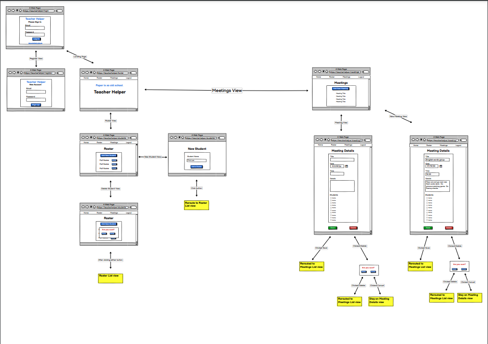
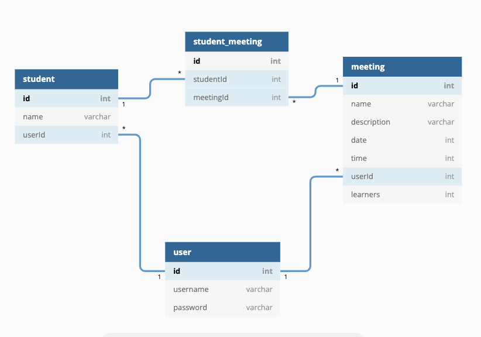

<!-- 

    

 -->

# Overview
Every day, teachers pull small groups of students daily to work on different academic and behavioral skills.  The topics and participants of these groups can change day to day as needed.  Currently, most teachers use paper-filled binders to organize these sessions. Due to the ever-changing group members and taught skills, paper and pencil management is very inefficient. With Teacher Helper, teachers can easily view and change their small group instruction plans.  Teacher Helper is the second in a series of apps meant to save teachers time and help them stay organized. This CRUD app is designed to be easy to navigate for teachers with limited technology experience.  After logging in, teachers can view and update their student roster as well as create, view, update, and delete small group meetings from their schedule.

# Features
<ul>
    <li>User authentication</li>
    <li>New user registration</li>
    <li>easy to navigate design</li>
    <li>Ability to create, read, update, and delete students from a roster</li>
    <li>Ability to create, read, update, and delete small group meetings from a meetings list</li>
</ul>

# User Stories
<ul>
    <li>As a user, I should be able to log in and view my current roster.</li>
    <li>As a user, I should be able to add a new student to my roster.</li>
    <li>As a user, I should be able to select a student from the roster and edit their name.</li>
    <li>As a user, I should be able to delete a student from my roster.</li>
    <li>As a user, I should be able to log in and view my current meetings list.</li>
    <li>As a user, I should be able add a new meeting to my meetings list.</li>
    <li>As a user, I should be able to select a meeting from the meetings list to view the meeting details.</li>
    <li>As a user, I should be able to delete past meetings.</li>
</ul>

<!-- # Images from Conference Cards

### Homepage

    

### Roster Menu

    

### View or Edit Current Student Card

    

### Create New Student Card

    

# Watch Conference Cards in Action
https://www.loom.com/share/6d03dddb31a649959c1a3174d9770de1 -->

# Wireframe

    

# ERD

    

# Technologies Used
HTML5 / CSS / JavaScript / React / SQL / Python / Django / Git

# Directions to Download 
git clone git@github.com:CassieTesauro/teacher-helper-client.git

# Link to Deployed App

# LInk to sister App: 'Conference Cards'
<a href="https://github.com/CassieTesauro/conference-cards" target="_blank">Conference Cards</a>

